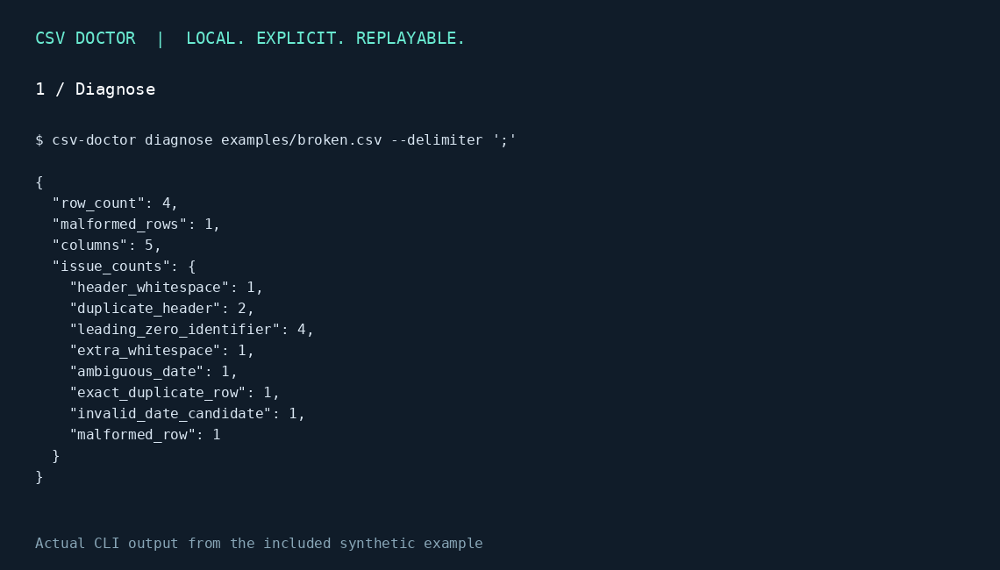

# CSV Doctor 🩺

**Broken CSV in. Explainable fixes out. Your files stay on your computer.**

A local browser tool and Python CLI for diagnosing CSV import problems, previewing explicit corrections, and exporting a reproducible repair recipe. No account, API key, telemetry, or external service required.



[Español](#español) · [Quick start](#quick-start) · [Example](#example) · [Limits](#limits)

## Why this exists

`001234` is an identifier. `1.234` might mean one point two three four or one thousand two hundred thirty-four. `03/04/2026` has two plausible meanings. CSV Doctor surfaces these decisions instead of silently guessing.

- Preserve CSV values as strings, including leading zeros.
- Diagnose duplicate/empty headers, whitespace, repeated rows, malformed records, encoding candidates, and ambiguous numbers/dates.
- Choose numeric convention (`es` / `en`) and date order (`DMY` / `MDY`) per selected columns.
- Preview changes and conversion failures before downloading.
- Quarantine malformed or duplicate-key records only when selected; retain their original values.
- Export `clean.csv`, a JSON recipe, a change report, quarantine records, and `replay.py`.
- Optional XLSX import, with explicit warnings about underlying values and formulas.

## Quick start

Python 3.10+:

```bash
git clone https://github.com/jairoequelal-ctrl/csv-doctor.git
cd csv-doctor
python -m pip install -e ".[excel]"
csv-doctor serve
```

Open **http://127.0.0.1:8765**. Upload a file → review diagnosis → select corrections → preview → download ZIP. For CSV-only use, install with `python -m pip install -e .` (no runtime dependencies).

This project is installed from source; these commands do not assume a PyPI release.

## Example

```bash
csv-doctor diagnose examples/broken.csv --delimiter ';'
csv-doctor apply examples/broken.csv --recipe examples/recipe.json --output output
python output/replay.py examples/broken.csv replayed
```

The included synthetic file has five data records. The explicit example recipe produces three output records and two quarantined records. It preserves `001234`, converts `1.234,56` to `1234.56`, interprets `03/04/2026` as April 3, and leaves an incompatible number and impossible date unchanged with two pending conversions.

Recipes select columns by **zero-based index**, so duplicate column names cannot redirect a repair. Deduplication keeps the first matching key after selected transformations. Empty keys are retained and reported.

## Export contract

| File | Purpose |
|---|---|
| `clean.csv` | UTF-8 with BOM, comma delimiter, repaired values |
| `recipe.json` | Explicit import settings and selected operations |
| `changes.json` | Source SHA-256, record counts, before/after changes, pending conversions, formula-export changes |
| `quarantine.json` | Original malformed and duplicate-key records |
| `replay.py` | Reapply the recipe using the installed package |

`source_row` means a logical CSV record number, including the header; a quoted multiline field can span multiple physical lines. XLSX uses worksheet row numbers. Replay is deterministic with the same source and package version; keep both with the exported bundle. The source checksum is recorded for audit, not enforced as a replay restriction.

Spreadsheet formula protection is enabled by default. Text starting with `=`, `+`, `-`, or `@` receives an apostrophe in CSV export; plain signed decimals remain unchanged. Those additional export changes are audited. This is a conservative safeguard, not a guarantee for every spreadsheet application.

## Limits

- 10 MiB input, 50,000 data records, 256 columns; XLSX expanded archive cap: 100 MiB.
- Local HTTP server binds to `127.0.0.1`, validates Host/Origin, and holds at most five imported sessions in memory. It has no authentication and should not be exposed through a public proxy.
- UI previews show the first 20 records and first 200 issues/changes; exports contain full reports.
- Automatic encoding/delimiter detection is a candidate. Check the preview; choose explicit settings when uncertain.
- Broken CSV quoting is rejected. Malformed field counts require explicit quarantine.
- No automatic mojibake repair, schema inference, missing-value imputation, currency parsing, or fuzzy deduplication.
- XLSX imports the first worksheet unless one is specified, reads underlying values, and retains formulas as text. It cannot recover zeros that exist only in number formatting. Only CSV output is produced.
- Numeric conversion can remove leading zeros if you explicitly select an identifier column. Leave identifiers unselected.

## Development

```bash
python -m pip install -e ".[excel]"
python -m unittest discover -s tests -v
```

Tests cover source preservation, row accounting, ambiguity, rejected conversions, formula auditing, XLSX semantics, recipe replay, and the local import/preview/ZIP API. Contributions welcome; see [CONTRIBUTING.md](CONTRIBUTING.md). MIT licensed.

## Español

**Repara CSV sin adivinar ni enviar tus datos a servicios externos.**

CSV Doctor conserva identificadores con ceros, detecta problemas de importación y te permite elegir cómo interpretar números y fechas. Cada corrección queda registrada. Los registros descartados por una regla explícita se guardan en cuarentena y los valores que no se pueden convertir se conservan como pendientes.

Instala el proyecto, ejecuta `csv-doctor serve` y abre la dirección local. Prueba primero `examples/broken.csv`. Selecciona las columnas de importe y fecha, la convención española y el orden día/mes/año. Revisa la vista previa antes de descargar el ZIP. No selecciones los identificadores para convertirlos a números.

Creado por [Jairo Quelal](https://github.com/jairoequelal-ctrl).
